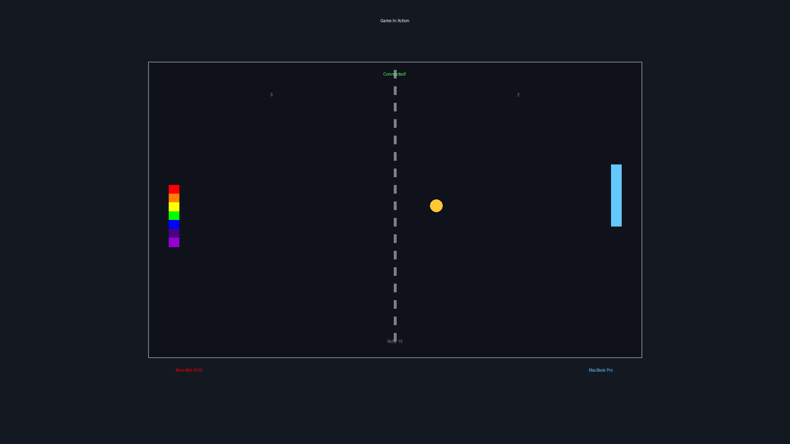
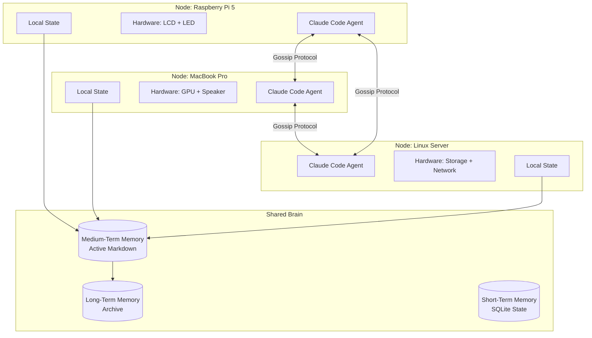
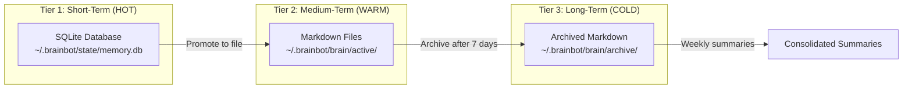
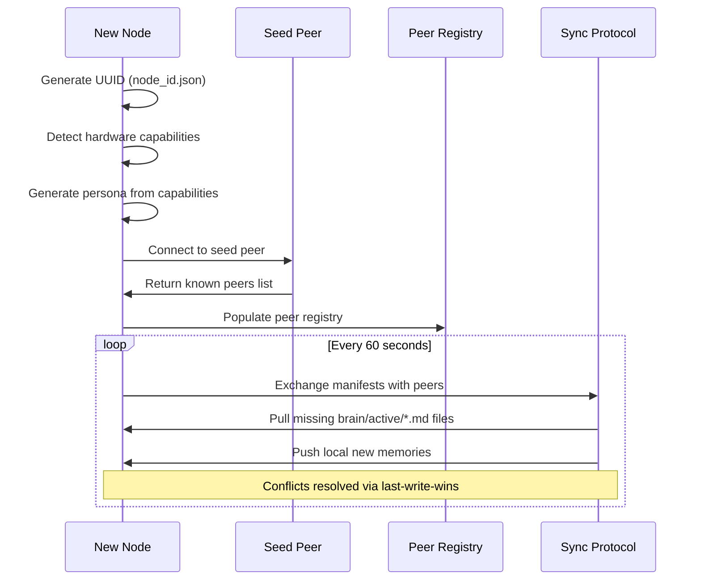
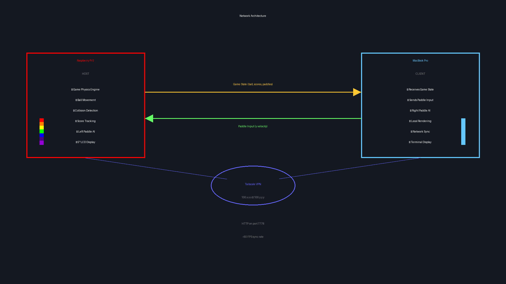
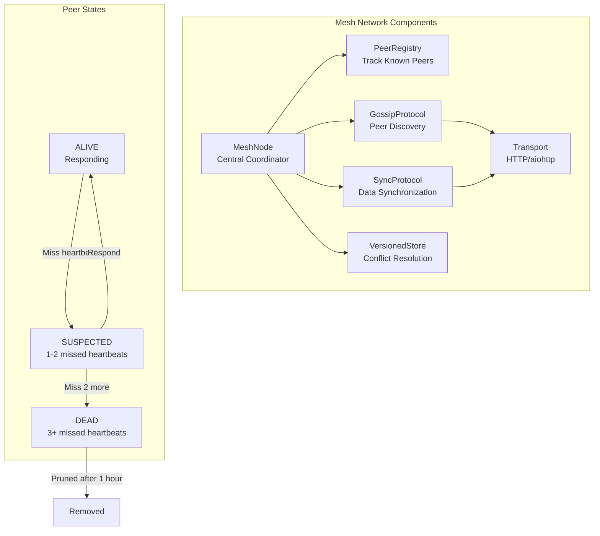
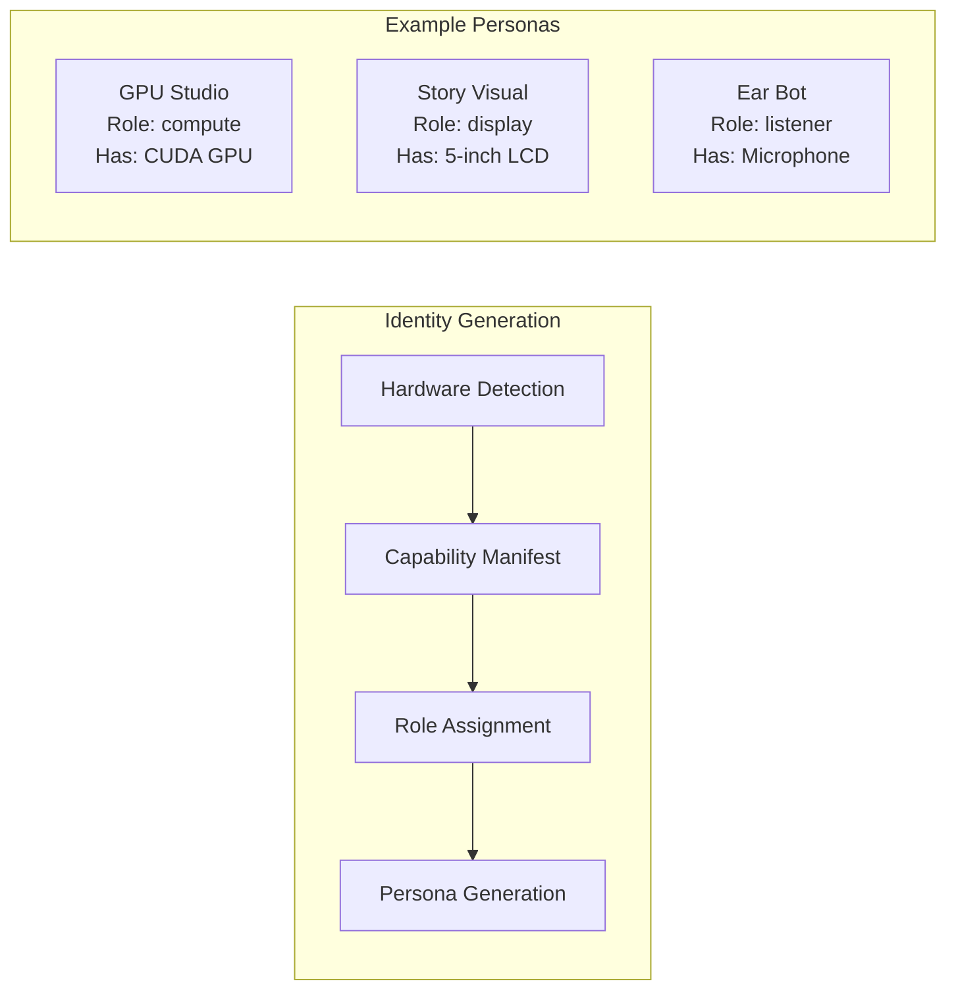
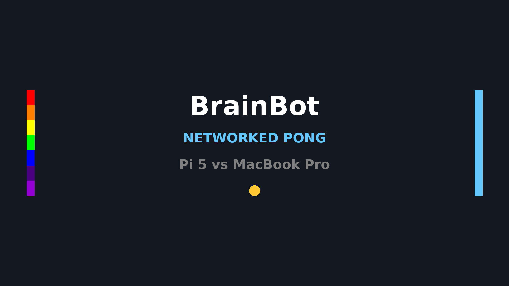

# BrainBot

[](https://www.python.org/downloads/)
[](https://opensource.org/licenses/MIT)
[](https://www.raspberrypi.org/)
[](https://claude.ai)

**One brain. Many bodies. Powered by Claude Code agents.**

[](https://youtu.be/bliV394AMk8?si=lvWQLMs7fNZSFcFk)

> *Click to watch two BrainBot agents play networked Pong across devices*

---

## What is BrainBot?

BrainBot is a distributed AI agent system where multiple devices share a single "brain" but operate as independent "bodies." Each node—whether a Raspberry Pi, MacBook, or Linux server—runs its own Claude Code agent while synchronizing memories across the mesh network.

**Yesterday, two BrainBot nodes played Pong against each other over the network.**



---

## Table of Contents

- [Executive Summary](#executive-summary)
- [Explain Like I'm Five](#explain-like-im-five)
- [Architecture Deep Dive](#architecture-deep-dive)
  - [The Distributed Brain](#the-distributed-brain)
  - [Memory System](#memory-system)
  - [Mesh Network](#mesh-network)
  - [Node Identity & Personas](#node-identity--personas)
- [Features](#features)
- [Getting Started](#getting-started)
- [Modes of Operation](#modes-of-operation)
- [Hardware Support](#hardware-support)
- [Screenshots & Media](#screenshots--media)
- [Technical Reference](#technical-reference)

---

## Executive Summary

BrainBot is an autonomous AI agent platform designed for edge computing. It implements a novel **distributed cognition architecture** where:

- **Shared Memory**: All nodes access a unified three-tier memory system (short-term, medium-term, long-term) that syncs via gossip protocol
- **Individual Bodies**: Each node has unique hardware capabilities (displays, sensors, GPUs) and auto-generated personas
- **Claude Code Powered**: Every node runs Claude Code agents that can delegate tasks, write code, and interact with their environment
- **Mesh Networking**: Nodes discover each other automatically, sync memories, and can collaborate on tasks or play games together

**Key Innovation**: Unlike traditional distributed systems where nodes are identical workers, BrainBot nodes are *individuals* with shared experiences—like humans who grew up together and share memories but have different bodies and capabilities.

### Current Capabilities

| Capability | Status |
|------------|--------|
| Autonomous daily schedule (wake/sleep/activities) | Production |
| Three-tier memory with automatic archival | Production |
| Mesh network peer discovery & sync | Production |
| Networked multiplayer games (Pong) | Production |
| Hardware control (LCD, LED, fan) | Production |
| Voice assistant mode | Production |
| Inter-node task delegation | Beta |
| Bedtime story generation | Production |

---

## Explain Like I'm Five

Imagine you have a best friend who lives far away. You both remember the same fun things you did together—like that time you built a treehouse! Even though you're in different places with different toys, you share the same memories.

**BrainBot is like that, but for computers!**

```
    🧠 One Brain (Shared Memories)
         /        |        \
        /         |         \
      🤖         🤖         🤖
    Pi Bot    Mac Bot    Linux Bot
   (has LCD)  (has GPU)  (has speaker)
```

- **The Brain** = All the memories and things BrainBot has learned
- **The Bodies** = Different computers (Raspberry Pi, MacBook, etc.)
- **Each body** has different superpowers (one has a screen, one is fast, one can talk)

When one BrainBot learns something new, it tells all the other BrainBots. When they play games together, they can see each other even though they're on different computers!

**Yesterday, the Pi Bot and Mac Bot played Pong together!** The Pi Bot controlled the rainbow paddle on the left, and Mac Bot controlled the blue paddle on the right. They talked over the internet to move the ball back and forth.

---

## Architecture Deep Dive

### The Distributed Brain

BrainBot implements a **federated memory architecture** where each node maintains a local copy of shared memories while contributing new experiences back to the collective.



### Memory System

BrainBot uses a **three-tier memory hierarchy** inspired by human memory:



#### Memory Tiers Explained

| Tier | Storage | Contents | Lifecycle |
|------|---------|----------|-----------|
| **Short-Term** | SQLite | Current goals, journal entries, active tasks | Session-based, persisted |
| **Medium-Term** | Markdown in `brain/active/` | Working memories, project notes, learnings | Tiered reading (recent = full, older = summary) |
| **Long-Term** | Markdown in `brain/archive/` | Historical memories organized by week/month | Auto-archived after 7 days inactive |

#### How New Nodes Sync Memories

When a new BrainBot node joins the network:



#### Memory Safety Features

- **Prompt injection protection**: All memories sanitized before inclusion in Claude prompts
- **Thread-safe access**: Database operations use locks and context managers
- **Storage tracking**: `memory_file_sync` table tracks origin node, hash, and sync status

### Mesh Network

Nodes communicate via an HTTP-based mesh network with gossip protocol for peer discovery:





#### Network Endpoints

| Endpoint | Method | Purpose |
|----------|--------|---------|
| `/heartbeat` | GET | Health check (every 10s) |
| `/gossip` | POST | Peer discovery exchange |
| `/sync/manifest` | GET | Metadata for sync comparison |
| `/sync/pull` | POST | Pull data from peer |
| `/sync/push` | POST | Push data to peer |
| `/chat` | POST | Inter-node chat messages |
| `/task` | POST | Task delegation |

### Node Identity & Personas

Each BrainBot node has a unique identity and auto-generated persona based on its hardware:



#### Hardware Capabilities Detected

- **Displays**: 1-inch OLED, 5-inch LCD, HDMI, headless
- **GPU**: CUDA, ROCm, Metal, None
- **Audio**: Microphone, speaker
- **Sensors**: Temperature, humidity, motion, light
- **Lighting**: NeoPixel LED strips
- **Network**: Ethernet, WiFi, Bluetooth

---

## Features

### Autonomous Operation

BrainBot runs on a daily schedule (US Central Time):

| Time | Activity |
|------|----------|
| 00:00 - 07:00 | Sleep (minimal activity, LEDs dim) |
| 07:00 | Wake up, morning routine |
| 07:15 | Review yesterday, plan today |
| 07:30 - 23:30 | Active period (coding, creating, learning) |
| 23:30 | Write bedtime story |
| 23:55 | Evening reflection |
| 00:00 | Go to sleep |

### Networked Games

BrainBot nodes can play games together! Currently supports **Networked Pong**:

```bash
# On the host (Raspberry Pi)
python -m brainbot.games.net_pong --host --persona "Pi 5"

# On the client (MacBook)
python -m brainbot.games.net_pong --join 192.168.1.100 --persona "MacBook Pro"
```

Features:
- Rainbow paddles with smooth color transitions
- Real-time game state sync at ~60 FPS
- Slack notifications for game events
- AI fallback if player disconnects
- `--loop` flag for continuous tournaments

### Voice Assistant

Full offline voice control with wake word detection:

```bash
python brain_bot.py --voice
```

- Wake word: "Computer"
- Speech-to-text via whisper.cpp
- Text-to-speech via Piper
- 100% offline after initial setup

### Hardware Control

MCP server for Raspberry Pi hardware:

```python
# 1-inch OLED display
lcd_1inch_text(line1="Status", line2="Active")

# LED mood lighting
led_mood("excited")  # Patterns: content, excited, focused, tired, curious

# Fan control
fan_auto()  # Temperature-based control
```

---

## Getting Started

### Quick Start (Daemon Mode)

```bash
# Clone the repository
git clone https://github.com/snedea/brainbot.git
cd brainbot

# Create virtual environment
python3 -m venv venv
source venv/bin/activate

# Install dependencies
pip install -r requirements.txt

# Initialize BrainBot
python -m brainbot init

# Start the daemon
python -m brainbot start

# Check status
python -m brainbot status
```

### Chat Mode (Interactive)

For the original TUI chat experience with local TinyLlama:

```bash
./setup.sh
./run.sh
```


### Multi-Node Setup

To add a new node to your BrainBot network:

1. Install BrainBot on the new device
2. Configure seed peers in `~/.brainbot/config/config.json`:
   ```json
   {
     "mesh": {
       "seed_peers": ["192.168.1.100:7777"]
     }
   }
   ```
3. Start the daemon—it will automatically:
   - Generate a unique node ID
   - Detect hardware capabilities
   - Create a persona
   - Connect to the mesh
   - Sync memories from peers

---

## Modes of Operation

| Mode | Command | Use Case |
|------|---------|----------|
| **Daemon** | `python -m brainbot start` | Autonomous operation with schedule |
| **Chat** | `python brain_bot.py` | Interactive TUI with local LLM |
| **Voice** | `python brain_bot.py --voice` | Voice assistant mode |
| **Foreground** | `python -m brainbot start -f` | Debugging daemon behavior |

---

## Hardware Support

### Tested Platforms

| Platform | Status | Notes |
|----------|--------|-------|
| Raspberry Pi 5 (4GB+) | Full support | Primary development platform |
| Raspberry Pi 4 (4GB+) | Full support | Voice mode slightly slower |
| MacBook (Apple Silicon) | Full support | Metal GPU acceleration |
| MacBook (Intel) | Full support | - |
| Linux x86_64 | Full support | CUDA if available |
| Windows WSL2 | Partial | No hardware integration |

### Supported Hardware

- **Displays**: SSD1306 OLED (1"), ILI9486 LCD (5"), HDMI
- **LEDs**: NeoPixel/WS2812B strips
- **Audio**: USB microphones, 3.5mm speakers
- **Cooling**: PWM fans with temperature control

---

## Screenshots & Media

### Networked Pong




### Chat Interface


### Placeholder: More Screenshots Coming

<!-- TODO: Add these screenshots -->
<!--  -->
<!--  -->
<!--  -->
<!--  -->
<!--  -->

---

## Technical Reference

### Data Directory Structure

```
~/.brainbot/
├── config/
│   ├── config.json          # Main configuration
│   ├── hardware.json        # GPIO pin mappings
│   ├── node_id.json         # Unique node identifier
│   └── persona.json         # Auto-generated persona
├── brain/
│   ├── active/              # Medium-term memories (synced)
│   └── archive/             # Long-term memories (YYYY-MM/week-NN/)
├── state/
│   ├── state.json           # Current bot state
│   ├── memory.db            # SQLite short-term storage
│   ├── journal/             # Daily markdown journals
│   └── goals/               # Active and completed goals
├── projects/                # Code projects BrainBot builds
├── bedtime_stories/         # Archive of generated stories
└── logs/                    # Daemon and session logs
```

### Key Files

| File | Purpose | LOC |
|------|---------|-----|
| `brainbot/memory/brain.py` | Markdown memory system | 885 |
| `brainbot/memory/store.py` | SQLite storage | 663 |
| `brainbot/network/mesh/node.py` | Mesh coordinator | 367 |
| `brainbot/network/mesh/sync.py` | Data synchronization | 433 |
| `brainbot/network/mesh/gossip.py` | Peer discovery | 324 |
| `brainbot/games/net_pong.py` | Networked Pong | 875 |

### Environment Variables

| Variable | Default | Description |
|----------|---------|-------------|
| `BRAINBOT_DATA_DIR` | `~/.brainbot` | Data directory |
| `BRAINBOT_TIMEZONE` | `America/Chicago` | Schedule timezone |
| `BRAINBOT_LOG_LEVEL` | `INFO` | Logging verbosity |

---

## Roadmap

- [ ] Multi-node task orchestration
- [ ] Distributed code execution
- [ ] More networked games (chess, collaborative puzzles)
- [ ] Web dashboard for mesh monitoring
- [ ] Mobile app for remote interaction
- [ ] Plugin system for custom activities

---

## License

MIT License - see [LICENSE](LICENSE) for details.

**Model Licenses**:
- TinyLlama: Apache 2.0
- Piper TTS: MIT
- whisper.cpp: MIT

---

## Acknowledgments

- **Claude Code** by Anthropic - Powers each BrainBot agent
- **Textual** - Python TUI framework
- **llama.cpp** - Local LLM inference
- **TinyLlama** - Compact chat model
- **Porcupine** - Wake word detection

---

**One brain. Many bodies. Infinite possibilities.**

*Built with curiosity by humans and Claude.*
