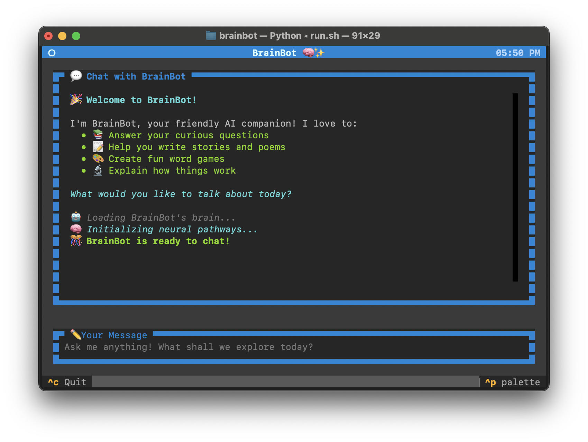

# 🧠✨ BrainBot - Your Smart AI Assistant!

[](https://www.python.org/downloads/)
[](https://opensource.org/licenses/MIT)
[](https://www.raspberrypi.org/)

**Meet BrainBot!** 🤖 Your very own colorful AI friend that lives on your computer and never needs the internet after you first meet! Perfect for anyone who loves asking "Why?" and "How?" about everything!



## ✨ What Makes BrainBot So Cool?

- **🎨 Super Colorful Screen**: Bright colors and fun emojis everywhere!
- **🔊 Speaks Out Loud!**: BrainBot can read responses to you with text-to-speech!
- **🔒 Always Helpful**: BrainBot only says nice, helpful things
- **📱 Works Anywhere**: No internet needed once BrainBot moves in
- **🚀 Easy to Set Up**: Get it running in minutes
- **🎯 Learn While Playing**: Great for homework help and creative fun
- **💻 Works on Small Computers**: Perfect for Raspberry Pi or old laptops
- **🖱️ Desktop Shortcut**: Double-click to launch from your desktop!

## 🎤 Voice Mode (New!)

**Talk to BrainBot like a real AI assistant!** The new voice mode lets you have natural conversations with BrainBot using just your voice.

### ✨ Voice Features
- **🎙️ Wake Word Activation**: Say "Computer" to start talking!
- **🗣️ Natural Speech**: Ask questions by speaking naturally
- **👂 Smart Listening**: Automatically detects when you're done talking
- **🔊 Speaks Responses**: BrainBot answers out loud with natural voice
- **🔒 100% Offline**: All voice processing happens on your device
- **🆓 Completely Free**: No subscriptions or cloud API costs

### 🚀 Quick Voice Setup

```bash
# One-time setup (10-15 minutes)
./setup_voice.sh

# Get free Porcupine key from https://console.picovoice.ai/
# Add it to .env file

# Launch voice mode
./launch_voice.sh
```

**That's it!** Say "Computer" followed by your question, and BrainBot will respond with voice!

📖 **Detailed guide**: See [VOICE_MODE.md](VOICE_MODE.md) for complete documentation

### Voice Requirements
- 🎤 USB microphone or 3.5mm mic
- 🔊 Speaker or headphones
- 🔑 Free Porcupine API key (get at [console.picovoice.ai](https://console.picovoice.ai/))
- 💾 Extra ~200MB for voice models

## 🎮 What Can You Do with BrainBot?

**Ask BrainBot anything!** Here are some super fun things to try:

- 🚀 **"How do rockets work?"** - Get cool science explanations!
- 📚 **"Tell me a story about a dragon who loves math"** - Creative bedtime stories!
- 🎨 **"Let's play a word game!"** - Fun puzzles and brain teasers!
- 🤔 **"What's 25 x 4?"** - Homework help that's actually fun!
- 🎭 **"Pretend you're a pirate and teach me about the ocean!"** - Learning through roleplay!

## 🚀 Getting Started

**Super Easy Setup!** Just copy and paste these commands:

### The Magic Commands ✨

```bash
# Download BrainBot
git clone https://github.com/snedea/brainbot.git
cd brainbot

# Run the setup (this does everything!)
./setup.sh

# Start chatting with BrainBot
./run.sh
```

**That's it!** 🎉 The first time takes about 10-15 minutes to download BrainBot's brain, then it's ready forever!

## 📋 What Do I Need?

**BrainBot is super flexible!** Works on lots of computers:

### Perfect For:
- 🍓 **Raspberry Pi 4** (the $35 computer!) - 4GB model works great
- 💻 **Old laptops** that seem too slow for other things
- 🖥️ **Any Mac, Windows, or Linux computer**

### You Need:
- **About 1GB of space** (for BrainBot's brain)
- **2-4GB of memory** (most computers have this)
- **Internet connection** (just once, to download BrainBot)
- **Speakers/Headphones** (optional, for text-to-speech feature)

## 🔧 Installation Guide

### Non-Technical Setup

1. **Install Python and Audio Support** (if not already installed):
   - **Raspberry Pi**: `sudo apt update && sudo apt install python3 python3-pip python3-venv espeak`
   - **Windows**: Download from [python.org](https://python.org)
   - **Mac**: Install via Homebrew: `brew install python3`

2. **Download BrainBot**:
   ```bash
   git clone https://github.com/yourusername/brainbot.git
   cd brainbot
   ```

3. **Run the setup script**:
   ```bash
   chmod +x setup.sh
   ./setup.sh
   ```

4. **Start BrainBot**:
   ```bash
   ./run.sh
   ```

### First Run

On the first run, BrainBot will:
1. Create a cache directory in your home folder
2. Download the TinyLlama AI model (~670MB)
3. Initialize the model for local use
4. Launch the colorful chat interface

**Note**: This process requires internet connection only once. After setup, BrainBot works completely offline!

## 🎮 How to Use

### Text Mode (Default)
1. **Start the application**:
   - Run `./run.sh` from terminal, OR
   - Double-click the **BrainBot 🧠✨** desktop shortcut
2. **Type your question**: Use the input box at the bottom
3. **Press Enter**: BrainBot will think and respond
4. **Toggle Voice Output**:
   - Press `Ctrl+T` to turn text-to-speech on/off
   - Look for status in top-right: 🔊 TTS: ON or 🔇 TTS: OFF
   - When ON, BrainBot reads all responses aloud!
5. **Keep chatting**: Ask follow-up questions or try new topics
6. **Exit**: Press `Ctrl+C` or `Ctrl+Q`

### Voice Mode (NEW!)
1. **Launch voice mode**: `python3 brain_bot.py --voice` or `./launch_voice.sh`
2. **Say wake word**: "Computer" (wait for listening indicator)
3. **Ask your question**: Speak naturally, BrainBot detects when you're done
4. **Hear response**: BrainBot speaks the answer aloud
5. **Type still works**: You can mix voice and text interactions!
6. **Test audio first**: Run `python3 brain_bot.py --test-audio` to check your mic

📖 Full voice mode guide: [VOICE_MODE.md](VOICE_MODE.md) | Quick start: [LAUNCH_GUIDE.md](LAUNCH_GUIDE.md)

### Cool Conversations with BrainBot! 💬

```
👤 You: Tell me about dinosaurs!

🤖 BrainBot: Dinosaurs were amazing creatures that lived millions of years ago!
Did you know some were as tiny as chickens and others were longer than school
buses? My favorite is the Triceratops - it had three horns and was a gentle
plant-eater, like a giant scaly cow! 🦕

👤 You: What's 7 x 8?

🤖 BrainBot: 7 × 8 = 56! Here's a fun trick: think of it as 7 groups of 8
cookies. If you had 7 friends and gave each friend 8 cookies, you'd need
56 cookies total! 🍪

👤 You: Write a poem about friendship

🤖 BrainBot: Friends are like stars that shine so bright,
They make the darkest days feel light.
When you're sad, they make you smile,
They'll stick with you mile after mile! ⭐
```

## ⚙️ Advanced Configuration

### Auto-Start on Boot (Raspberry Pi)

To make BrainBot start automatically when your Pi boots up:

```bash
# Copy the service file
sudo cp scripts/brainbot.service /etc/systemd/system/

# Edit the service file to match your setup
sudo nano /etc/systemd/system/brainbot.service

# Enable the service
sudo systemctl enable brainbot.service
sudo systemctl start brainbot.service
```

### Performance Tuning

Edit `brain_bot.py` to adjust these settings:

```python
# Model settings (in BrainBotApp.initialize_model)
Llama(
    model_path=str(self.model_path),
    n_ctx=2048,        # Increase for longer conversations
    n_threads=4,       # Match your CPU core count
    temperature=0.7,   # Lower = more focused, Higher = more creative
)
```

## 🛠️ Troubleshooting

### Common Issues

**BrainBot won't start:**
- Check Python version: `python3 --version`
- Ensure virtual environment is activated
- Verify all dependencies: `pip list`

**Model download fails:**
- Check internet connection
- Clear cache: `rm -rf ~/.cache/brainbot`
- Retry setup script

**Slow responses:**
- Reduce `n_ctx` in model settings
- Close other applications
- Check available RAM

**Text-to-Speech not working:**
- Install espeak: `sudo apt install espeak` (Raspberry Pi/Linux)
- Check volume settings on your system
- Verify speakers/headphones are connected
- Press `Ctrl+T` to toggle TTS on

**UI looks broken:**
- Update terminal/terminal emulator
- Try different terminal size
- Check textual compatibility: `python -c "import textual; print(textual.__version__)"`

### Getting Help

1. Check our [troubleshooting guide](docs/TROUBLESHOOTING.md)
2. Review [Raspberry Pi setup guide](docs/SETUP_PI.md)
3. Open an issue on GitHub

## 🎯 For families and friends!

Want to make BrainBot even cooler? Check out the `brain_bot.py` file - it's full of comments explaining how everything works!

You could try:
- 🎨 Changing the colors in the CSS section
- 🤖 Modifying BrainBot's personality in the SYSTEM_PROMPT
- ✨ Adding new emoji reactions
- 🎵 Making BrainBot respond with ASCII art!

See `CLAUDE.md` for technical development details.

## 📚 Educational Value

BrainBot is designed to be educational:

- **Programming Concepts**: The code is well-commented for curious minds
- **AI Understanding**: Demonstrates how AI works locally
- **Terminal Skills**: Introduces command-line interfaces
- **Problem Solving**: Encourages asking questions and exploring

## 🔒 Super Safe and Private!

**You'll love this:**
- 🏠 **Everything stays on YOUR computer** - no data sent anywhere
- 📵 **Works without internet** - once set up, no online connection needed
- 👀 **You can see all the code** - nothing hidden, everything open!

## 📖 Technical Details

### Architecture
- **Frontend**: Textual (Python TUI framework)
- **AI Engine**: Llama.cpp with TinyLlama model
- **Model Size**: ~670MB (quantized 4-bit)
- **Memory Usage**: ~1-2GB during operation

### Model Information
- **Model**: TinyLlama 1.1B Chat v1.0
- **Quantization**: Q4_K_M (good balance of speed/quality)
- **Context Window**: 2048 tokens
- **License**: Apache 2.0

## 🔮 Cool Ideas for the Future!

**What would make BrainBot even more awesome?**
- ~~🔊 **BrainBot speaks responses out loud!**~~ ✅ Done! Press Ctrl+T to enable!
- ~~🎤 **Talk to BrainBot with your voice!**~~ ✅ Done! Use `--voice` flag for full voice assistant!
- 🎨 **BrainBot draws pictures with text!** (ASCII art)
- 📊 **Keep track of what you're learning**
- 🎮 **Built-in word games and puzzles**
- 📱 **BrainBot on tablets too!**
- 🌍 **Multi-language support** (voice mode supports 90+ languages with different models)

*Have your own cool idea? Feel free to suggest it on GitHub!*

## 📄 License

This project is licensed under the MIT License - see the [LICENSE](LICENSE) file for details.

## 🙏 Acknowledgments

- **Textual**: Amazing Python TUI framework
- **Llama.cpp**: Efficient local AI inference
- **TinyLlama**: Perfect sized model for edge devices
- **Hugging Face**: Model hosting and distribution

## 🆘 Need Help?

**If something isn't working:**
- 📚 **Check the help docs** in the `docs/` folder
- 💬 **Ask for help** on GitHub
- 🔍 **Look at existing questions** - someone might have had the same problem!

---

**Made with ❤️ for curious minds everywhere!**

*Keep exploring, keep learning, keep being amazing! 🌟*